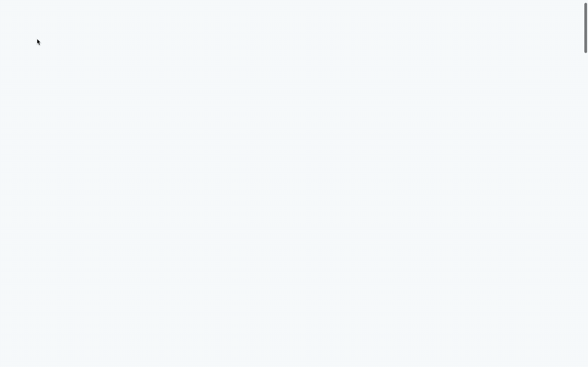

# freeCodeCamp Responsive Web Design Projects - Build a Personal Portfolio Webpage

Welcome to the repository for my 2019 portfolio website. This project showcases my web development skills and serves as a digital resume. The portfolio is built using HTML, CSS, and JavaScript, incorporating various features to create an engaging and visually appealing experience for visitors.

## Table of Contents

- [Description](#description)
- [Features](#features)
- [Demo](#demo)
- [Prerequisites](#prerequisites)
- [Installation](#installation)
- [Troubleshooting](#troubleshooting)
- [Contributing](#contributing)
- [Acknowledgments](#acknowledgments)
- [Contact](#contact)

## Description

This repository holds the source code for my 2019 portfolio website, designed to showcase my skills, projects, and experiences as a web developer. The portfolio is structured with a modern and responsive design, featuring CSS animations and media queries to ensure optimal viewing across various devices.

The project originated as part of the freeCodeCamp Responsive Web Design Projects, specifically the "Build a Personal Portfolio Webpage" challenge. It fulfils the following user stories:

- [x] **User Story #1:** My portfolio should have a welcome section with an id of welcome-section.
- [x] **User Story #2:** The welcome section should have an h1 element that contains text.
- [x] **User Story #3:** My portfolio should have a projects section with an id of projects.
- [x] **User Story #4:** The projects section should contain at least one element with a class of project-tile to hold a project.
- [x] **User Story #5:** The projects section should contain at least one link to a project.
- [x] **User Story #6:** My portfolio should have a navbar with an id of navbar.
- [x] **User Story #7:** The navbar should contain at least one link that I can click on to navigate to different sections of the page.
- [x] **User Story #8:** My portfolio should have a link with an id of profile-link, which opens my GitHub or FCC profile in a new tab.
- [x] **User Story #9:** My portfolio should have at least one media query.
- [x] **User Story #10:** The height of the welcome section should be equal to the height of the viewport.
- [x] **User Story #11:** The navbar should always be at the top of the viewport.

## Features

- **Responsive Design:** The portfolio is crafted to provide an optimal viewing experience on a wide range of devices, from desktops to mobile phones.
  
- **CSS Animations:** Engage visitors with smooth and visually appealing CSS animations that bring elements to life as they scroll through the portfolio.

- **Media Queries:** Tailored styles for different screen sizes ensure a consistent and user-friendly experience, adapting to the diverse landscape of web-enabled devices.

## Demo

View the live demo on CodePen: [Karl Horning's Portfolio Webpage 2019](https://codepen.io/karlhorning/pen/JjzdxbM)

## Prerequisites

Make sure you have a web browser to view the project.

## Installation

To run this project locally, follow these steps:

1. Clone the repository: `git clone https://github.com/Karl-Horning/portfolio-2019.git`
2. Navigate to the project directory: `cd portfolio-2019`
3. Open `index.html` in your preferred web browser.

## Troubleshooting

- If you encounter any issues during installation or execution, please ensure that your web browser is up to date.

## Contributing

Contributions are welcome! Please follow these guidelines:

1. Fork the repository.
2. Create a new branch for your feature or bug fix.
3. Make your changes and ensure that the project still works.
4. Create a pull request with a clear description of your changes.

## Acknowledgments

- [Normalize.css](https://necolas.github.io/normalize.css/): A modern, HTML5-ready alternative to CSS resets.
- [References](#references): Check out some useful resources that inspired or contributed to this project.

## Contact

For any inquiries or support related to this portfolio, please contact Karl Horning.

## Author

Karl Horning: [GitHub](https://github.com/Karl-Horning/) | [LinkedIn](https://www.linkedin.com/in/karl-horning/) | [CodePen](https://codepen.io/karlhorning)

### References

- [How TO - CSS Arrows](https://www.w3schools.com/howto/howto_css_arrows.asp)
- [iHover](http://gudh.github.io/ihover/dist/)
- [Smooth Scrolling](https://css-tricks.com/snippets/jquery/smooth-scrolling/)